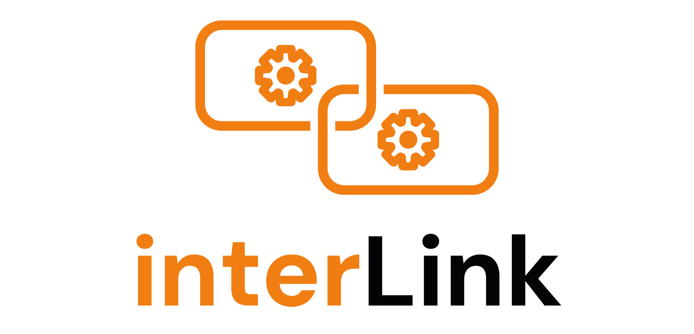

# Welcome to the interLink Project

[](https://img.shields.io/github/license/interlink-hq/interlink)


[](https://goreportcard.com/report/github.com/interlink-hq/interlink)

[](https://join.slack.com/t/intertwin/shared_invite/zt-2cs67h9wz-2DFQ6EiSQGS1vlbbbJHctA)



interLink is an abstraction layer for executing Kubernetes pods on remote resources capable of managing container execution lifecycles.

It facilitates the development of provider-specific plugins for the [Kubernetes Virtual Kubelet interface](https://virtual-kubelet.io/), enabling resource providers to leverage Virtual Kubelet capabilities without deep Kubernetes internals knowledge.

## Architecture

The project consists of two main components:

- **Virtual Kubelet (Virtual Node)**: Translates Kubernetes pod execution requests into remote calls to the interLink API server
- **interLink API Server**: A modular, pluggable REST server with provider-specific plugins (sidecars) for different execution environments

## Key Features

- **Plugin-based Architecture**: Extensible sidecar system for different remote providers
- **Multiple Deployment Patterns**: Edge-node, in-cluster, and tunneled configurations  
- **Built-in Observability**: OpenTelemetry integration with distributed tracing and metrics
- **Secure Communication**: TLS/mTLS encryption and authentication between components
- **Authentication**: OAuth2 integration and bearer token support
- **Standard Kubernetes API**: Maintains full compatibility with existing K8s tooling

interLink is hosted by the
[Cloud Native Computing Foundation (CNCF)](https://cncf.io).

## Getting Started

For usage and development guides please refer to
[our site](https://interlink-hq.github.io/interLink/)

## Development

```bash
# Build all components
make all

# Run tests (uses Dagger for containerized testing)
make test

# Generate OpenAPI specifications
make openapi

# Clean build artifacts
make clean
```

## Adopters

Please find all our current adopters [here](./ADOPTERS.md)

## Contributing

Our project welcomes contributions from any member of our community. To get
started contributing, please see our [Contributor Guide](./CONTRIBUTING.md).

## Supported Providers

interLink supports a wide range of remote execution environments through its plugin architecture:

- **HPC Batch Systems**: SLURM, HTCondor with Apptainer, Enroot, or Singularity containers
- **Virtual Machines**: On-demand VMs with Docker, Podman, or other container runtimes  
- **Remote Kubernetes**: Offload workloads to external Kubernetes clusters
- **Serverless**: Lambda-like services for event-driven container execution
- **Custom Providers**: Extensible plugin system for any container-capable remote resource

## Use Cases

### In Scope
- **HPC Workloads**: AI training, ML inference, scientific simulations requiring specialized hardware
- **GPU-intensive Tasks**: Remote execution on powerful GPU resources for ML training, data analysis, rendering
- **Batch Processing**: On-demand container execution with specific compute requirements
- **Hybrid Cloud**: Workload distribution across multiple infrastructure providers

### Out of Scope  
- **Long-running Services**: Persistent services with continuous availability requirements
- **Kubernetes Federation**: Multi-cluster resource management and federation

## Communications

- [](https://join.slack.com/t/intertwin/shared_invite/zt-2cs67h9wz-2DFQ6EiSQGS1vlbbbJHctA)

## Resources

[](https://www.youtube.com/watch?v=bIxw1uK0QRQ)
[](https://www.youtube.com/watch?v=vTg58Nd7_58)
[](https://www.youtube.com/watch?v=M3uLQiekqo8)

## License

This project is licensed under [Apache2](./LICENSE)

## Conduct

We follow the [CNCF Code of Conduct](./CODE_OF_CONDUCT.md)
