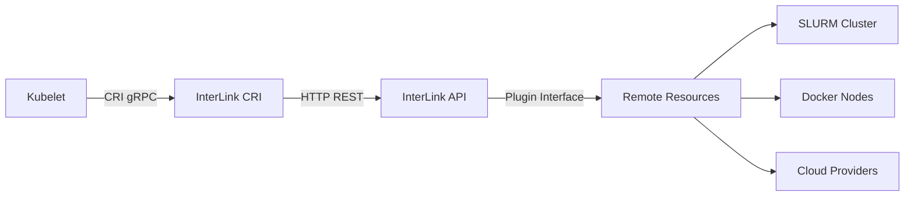

# CRI Integration Overview

The interLink Container Runtime Interface (CRI) implementation enables direct integration with kubelet, allowing interLink to function as a native Kubernetes container runtime. This provides an alternative to the Virtual Kubelet approach for running containers on remote resources.

## What is CRI Integration?

The Container Runtime Interface (CRI) is a plugin interface that enables kubelet to use different container runtimes. interLink's CRI implementation acts as a bridge between kubelet and interLink's remote execution capabilities.



## Benefits of CRI Integration

### Standard Kubernetes Experience
- **Native kubectl support** - All standard kubectl commands work unchanged
- **Kubernetes API compatibility** - Full integration with Kubernetes controllers
- **Resource management** - Leverage Kubernetes native resource scheduling
- **Service discovery** - Standard Kubernetes service networking

### Simplified Architecture
- **Direct kubelet integration** - No need for Virtual Kubelet deployment
- **Reduced complexity** - Fewer components to manage and monitor
- **Standard workflows** - Use existing Kubernetes deployment patterns

### Enhanced Features
- **Pod lifecycle management** - Complete container lifecycle support
- **Resource quotas** - Standard Kubernetes resource management
- **Health checks** - Native readiness and liveness probe support
- **Log streaming** - Standard kubectl logs functionality

## When to Use CRI vs Virtual Kubelet

### Use CRI Integration When:
- You want direct kubelet integration
- You prefer standard Kubernetes workflows
- You need tight integration with Kubernetes scheduling
- You want to minimize architectural complexity

### Use Virtual Kubelet When:
- You need to represent remote resources as virtual nodes
- You want more flexibility in node characteristics
- You need custom node labeling and tainting
- You're running in managed Kubernetes environments

## Architecture Comparison

### Virtual Kubelet Approach
```
┌─────────────┐    ┌──────────────┐    ┌─────────────┐
│ kube-apiserver │    │ Virtual Kubelet │    │ InterLink   │
│             │────┤              │────┤ Plugin      │
└─────────────┘    └──────────────┘    └─────────────┘
```

### CRI Integration Approach
```
┌─────────────┐    ┌─────────────┐    ┌─────────────┐
│   Kubelet   │    │ InterLink   │    │ InterLink   │
│             │────┤ CRI Runtime │────┤ Plugin      │
└─────────────┘    └─────────────┘    └─────────────┘
```

## Getting Started

1. **[Quick Start](01-quickstart.md)** - Get up and running in 5 minutes
2. **[Usage Guide](02-usage-guide.md)** - Comprehensive setup and configuration
3. **[Technical Reference](03-technical-reference.md)** - Implementation details and architecture

## Supported Features

### ✅ Fully Supported
- Container creation, start, stop, removal
- Pod sandbox management
- Resource limits and requests
- Environment variables
- Basic networking
- Log retrieval
- Command execution

### 🚧 Partial Support
- Volume mounts (basic support)
- Init containers
- Security contexts
- Network policies

### 📋 Planned Features
- Advanced volume types
- Pod security policies
- Custom resource definitions
- Enhanced networking

## Requirements

- **Kubernetes 1.24+** with CRI support
- **Go 1.21+** for building
- **InterLink 0.6+** with CRI implementation
- **Linux-based kubelet** (recommended)

## Community and Support

The CRI integration is actively developed and maintained. For questions, issues, or contributions:

- **GitHub Issues**: [Report bugs or request features](https://github.com/interlink-hq/interlink/issues)
- **Discussions**: [Community discussions](https://github.com/interlink-hq/interlink/discussions)
- **Documentation**: [Main interLink documentation](https://interlink.readthedocs.io/)

---

Ready to get started? Check out the **[Quick Start Guide](01-quickstart.md)** for a fast setup, or dive into the **[Usage Guide](02-usage-guide.md)** for comprehensive configuration options.