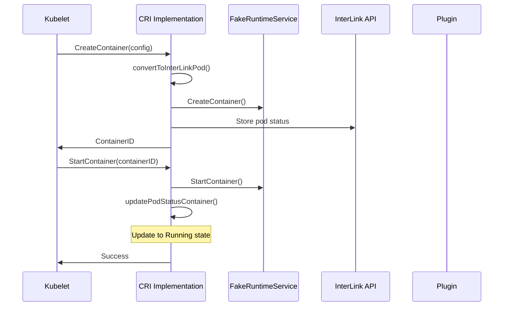

# InterLink CRI Technical Reference

This document provides technical details about the interLink CRI implementation, architecture decisions, and implementation patterns.

## Architecture Overview

### Component Interaction

```
┌─────────────────┐         ┌─────────────────┐         ┌─────────────────┐
│     Kubelet     │         │ InterLink CRI   │         │ InterLink API   │
│                 │         │ Implementation  │         │ Server          │
├─────────────────┤  gRPC   ├─────────────────┤  HTTP   ├─────────────────┤
│ CRI Client      │◄────────┤ gRPC Server     │────────►│ REST Handlers   │
│ (Container      │         │ (RemoteRuntime) │         │ - Create        │
│  Management)    │         │                 │         │ - Delete        │
└─────────────────┘         └─────────────────┘         │ - Status        │
                                     │                   │ - Logs          │
                                     ▼                   └─────────────────┘
                            ┌─────────────────┐                   │
                            │ Pod Status      │                   ▼
                            │ Tracking        │         ┌─────────────────┐
                            │ (PodStatuses)   │         │ Plugin System   │
                            └─────────────────┘         │ (SLURM, Docker, │
                                                        │  Custom, etc.)  │
                                                        └─────────────────┘
```

### Key Components

#### 1. RemoteRuntime Structure

```go
type RemoteRuntime struct {
    server *grpc.Server                    // gRPC server for CRI
    RuntimeService *apitest.FakeRuntimeService  // CRI compatibility layer
    ImageService *apitest.FakeImageService      // Image management
    InterLinkHandler *api.InterLinkHandler      // Integration with interLink
}
```

#### 2. Container Lifecycle Integration

The CRI implementation integrates with interLink's lifecycle through these key methods:

- **CreateContainer**: Converts CRI → interLink pod format
- **StartContainer**: Updates interLink pod status tracking
- **StopContainer**: Manages container termination
- **RemoveContainer**: Cleans up tracking state

## Implementation Details

### Container Creation Flow



### Pod Status Management

The implementation maintains pod status through the `PodStatuses` global structure:

```go
type MutexStatuses struct {
    mu       sync.Mutex
    Statuses map[string]types.PodStatus
}

var PodStatuses MutexStatuses
```

#### Helper Functions

```go
// Safe access to pod status without exposing mutex
func getPodStatus(uid string) (types.PodStatus, bool)
func updatePodStatusContainer(sandboxID string, containerStatus v1.ContainerStatus)
func removePodStatusContainer(sandboxID string, containerName string)
func removePodStatus(uid string)
```

### Type Conversion

#### CRI to Kubernetes Pod Conversion

```go
func convertToInterLinkPod(
    ctx context.Context, 
    sandboxConfig *kubeapi.PodSandboxConfig,
    containerConfig *kubeapi.ContainerConfig
) *v1.Pod {
    pod := &v1.Pod{
        ObjectMeta: metav1.ObjectMeta{
            Name:      sandboxConfig.Metadata.Name,
            Namespace: sandboxConfig.Metadata.Namespace,
            UID:       ktypes.UID(sandboxConfig.Metadata.Uid),
        },
        Spec: v1.PodSpec{
            Containers: []v1.Container{
                {
                    Name:       containerConfig.Metadata.Name,
                    Image:      containerConfig.Image.Image,
                    Command:    containerConfig.Command,
                    Args:       containerConfig.Args,
                    WorkingDir: containerConfig.WorkingDir,
                },
            },
        },
        Status: v1.PodStatus{
            Phase: v1.PodPending,
        },
    }
    
    // Environment variable conversion
    if len(containerConfig.Envs) > 0 {
        envVars := make([]v1.EnvVar, len(containerConfig.Envs))
        for i, env := range containerConfig.Envs {
            envVars[i] = v1.EnvVar{
                Name:  env.Key,
                Value: env.Value,
            }
        }
        pod.Spec.Containers[0].Env = envVars
    }
    
    // Resource conversion
    if containerConfig.Linux != nil && containerConfig.Linux.Resources != nil {
        resources := v1.ResourceRequirements{}
        
        // CPU limits
        if containerConfig.Linux.Resources.CpuQuota > 0 {
            resources.Limits = v1.ResourceList{
                v1.ResourceCPU: *resource.NewMilliQuantity(
                    containerConfig.Linux.Resources.CpuQuota/1000, 
                    resource.DecimalSI,
                ),
            }
        }
        
        // Memory limits
        if containerConfig.Linux.Resources.MemoryLimitInBytes > 0 {
            if resources.Limits == nil {
                resources.Limits = v1.ResourceList{}
            }
            resources.Limits[v1.ResourceMemory] = *resource.NewQuantity(
                containerConfig.Linux.Resources.MemoryLimitInBytes, 
                resource.BinarySI,
            )
        }
        
        pod.Spec.Containers[0].Resources = resources
    }
    
    return pod
}
```

## CRI Interface Implementation

### Runtime Service Methods

#### Core Container Lifecycle

```go
// Container creation with interLink integration
func (f *RemoteRuntime) CreateContainer(
    ctx context.Context, 
    req *kubeapi.CreateContainerRequest
) (*kubeapi.CreateContainerResponse, error) {
    // 1. Create in fake runtime for CRI compatibility
    containerID, err := f.RuntimeService.CreateContainer(
        ctx, req.PodSandboxId, req.Config, req.SandboxConfig
    )
    
    // 2. Convert to interLink format and track
    if f.InterLinkHandler != nil {
        pod := f.convertToInterLinkPod(ctx, req.SandboxConfig, req.Config)
        podStatus := types.PodStatus{
            PodName:      pod.Name,
            PodNamespace: pod.Namespace,
            PodUID:       string(pod.UID),
            Containers:   []v1.ContainerStatus{},
        }
        api.PodStatuses.Statuses[string(pod.UID)] = podStatus
    }
    
    return &kubeapi.CreateContainerResponse{ContainerId: containerID}, nil
}
```

#### Container State Management

```go
func (f *RemoteRuntime) StartContainer(
    ctx context.Context, 
    req *kubeapi.StartContainerRequest
) (*kubeapi.StartContainerResponse, error) {
    // Start in fake runtime
    err := f.RuntimeService.StartContainer(ctx, req.ContainerId)
    
    // Update interLink tracking
    if f.InterLinkHandler != nil {
        f.RuntimeService.Lock()
        container, exists := f.RuntimeService.Containers[req.ContainerId]
        f.RuntimeService.Unlock()
        
        if exists {
            containerStatus := v1.ContainerStatus{
                Name:  container.Metadata.Name,
                Image: container.Image.Image,
                State: v1.ContainerState{
                    Running: &v1.ContainerStateRunning{
                        StartedAt: metav1.NewTime(time.Now()),
                    },
                },
                Ready: true,
            }
            updatePodStatusContainer(container.SandboxID, containerStatus)
        }
    }
    
    return &kubeapi.StartContainerResponse{}, nil
}
```

### Pod Sandbox Management

```go
func (f *RemoteRuntime) RemovePodSandbox(
    ctx context.Context, 
    req *kubeapi.RemovePodSandboxRequest
) (*kubeapi.RemovePodSandboxResponse, error) {
    // Clean up interLink tracking
    if f.InterLinkHandler != nil {
        if podStatus, found := getPodStatus(req.PodSandboxId); found {
            // Create deletion object for interLink
            pod := &v1.Pod{
                ObjectMeta: metav1.ObjectMeta{
                    Name:      podStatus.PodName,
                    Namespace: podStatus.PodNamespace,
                    UID:       ktypes.UID(podStatus.PodUID),
                },
            }
            // Clean up tracking
            removePodStatus(req.PodSandboxId)
        }
    }
    
    // Remove from fake runtime
    return &kubeapi.RemovePodSandboxResponse{}, 
           f.RuntimeService.StopPodSandbox(ctx, req.PodSandboxId)
}
```

## Integration Patterns

### 1. Dual-Layer Architecture

The implementation uses a dual-layer approach:

- **CRI Layer**: Maintains compatibility with kubelet expectations
- **InterLink Layer**: Provides actual container execution via plugins

```go
// CRI compatibility
containerID, err := f.RuntimeService.CreateContainer(...)

// InterLink integration  
if f.InterLinkHandler != nil {
    // Convert and track in interLink
    pod := f.convertToInterLinkPod(...)
    // Store in PodStatuses for lifecycle management
}
```

### 2. State Synchronization

Container states are synchronized between CRI and interLink:

```go
// Container state in CRI format
criState := &kubeapi.ContainerState{...}

// Container state in Kubernetes format (for interLink)
k8sState := v1.ContainerState{
    Running: &v1.ContainerStateRunning{
        StartedAt: metav1.NewTime(time.Now()),
    },
}
```

### 3. Resource Mapping

Resources are mapped from CRI limits to Kubernetes resource requirements:

```go
// CRI resource limits
cpuQuota := containerConfig.Linux.Resources.CpuQuota
memoryLimit := containerConfig.Linux.Resources.MemoryLimitInBytes

// Kubernetes resource requirements
resources := v1.ResourceRequirements{
    Limits: v1.ResourceList{
        v1.ResourceCPU: *resource.NewMilliQuantity(cpuQuota/1000, resource.DecimalSI),
        v1.ResourceMemory: *resource.NewQuantity(memoryLimit, resource.BinarySI),
    },
}
```

## Thread Safety

### Mutex Usage

The implementation handles concurrent access through multiple mutex layers:

1. **FakeRuntimeService**: Internal mutex for CRI state
2. **PodStatuses**: Global mutex for interLink tracking (accessed via helpers)
3. **InterLinkHandler**: HTTP client safety

### Safe Access Patterns

```go
// Safe container access
f.RuntimeService.Lock()
container, exists := f.RuntimeService.Containers[containerID]
f.RuntimeService.Unlock()

// Safe pod status access (via helpers)
podStatus, found := getPodStatus(sandboxID)
updatePodStatusContainer(sandboxID, containerStatus)
```

## Error Handling

### Graceful Degradation

The implementation gracefully handles missing components:

```go
// InterLink integration is optional
if f.InterLinkHandler != nil {
    // Perform interLink operations
    // Errors here don't fail the CRI operation
}

// CRI operation always completes
return &kubeapi.CreateContainerResponse{ContainerId: containerID}, nil
```

### Error Propagation

```go
// CRI errors are propagated to kubelet
if err != nil {
    return nil, fmt.Errorf("failed to create container: %w", err)
}

// InterLink errors are logged but don't fail CRI operations
if interlinkErr != nil {
    log.G(ctx).Warning("InterLink operation failed: ", interlinkErr)
    // Continue with CRI response
}
```

## Performance Considerations

### Memory Usage

- **Container Tracking**: O(n) memory for n containers
- **Pod Status**: Centralized tracking with cleanup on removal
- **gRPC Buffers**: Standard gRPC memory patterns

### Network Efficiency

- **HTTP Keep-Alive**: Reused connections to interLink API
- **Batched Updates**: Status updates batched where possible
- **Local State**: CRI state maintained locally for fast responses

### Scalability

- **Concurrent Operations**: Thread-safe design supports concurrent CRI calls
- **Plugin Independence**: CRI operations don't block on plugin responses
- **Resource Limits**: Configurable timeouts and limits

## Debugging and Observability

### Logging Integration

```go
import "github.com/containerd/containerd/log"

// Structured logging with context
log.G(ctx).Info("Container created", 
    "containerID", containerID,
    "podName", pod.Name,
    "namespace", pod.Namespace)
```

### Tracing Support

The implementation integrates with interLink's OpenTelemetry tracing:

```go
tracer := otel.Tracer("interlink-cri")
_, span := tracer.Start(ctx, "CreateContainer")
defer span.End()

span.SetAttributes(
    attribute.String("container.name", containerConfig.Metadata.Name),
    attribute.String("pod.uid", sandboxConfig.Metadata.Uid),
)
```

### Metrics

Key metrics tracked:
- Container creation/deletion rates
- State transition timings  
- Error rates by operation type
- Resource utilization

## Extension Points

### Custom Resource Mapping

```go
// Extend convertToInterLinkPod for custom resources
if customResource := containerConfig.Annotations["custom-resource"]; customResource != "" {
    // Handle custom resource types
    pod.Spec.Containers[0].Resources.Limits["example.com/gpu"] = 
        resource.MustParse(customResource)
}
```

### Plugin-Specific Annotations

```go
// Pass plugin-specific metadata through annotations
pod.Annotations = map[string]string{
    "interlink.io/plugin":    "slurm",
    "interlink.io/partition": "gpu",
    "interlink.io/qos":       "high",
}
```

### Custom State Handlers

```go
// Extend status mapping for custom states
func mapCustomState(interlinkState types.ContainerState) *kubeapi.ContainerState {
    // Custom state mapping logic
    return criState
}
```

## Testing Considerations

### Unit Testing

```go
func TestCreateContainer(t *testing.T) {
    // Mock InterLinkHandler
    mockHandler := &api.InterLinkHandler{...}
    
    // Create runtime with mock
    runtime := NewFakeRemoteRuntime(mockHandler)
    
    // Test container creation
    req := &kubeapi.CreateContainerRequest{...}
    resp, err := runtime.CreateContainer(context.Background(), req)
    
    // Verify CRI response
    assert.NoError(t, err)
    assert.NotEmpty(t, resp.ContainerId)
    
    // Verify interLink integration
    podStatus, found := getPodStatus(req.PodSandboxId)
    assert.True(t, found)
    assert.Equal(t, expectedPodName, podStatus.PodName)
}
```

### Integration Testing

```go
func TestEndToEndWorkflow(t *testing.T) {
    // Start test interLink server
    testServer := startTestInterLinkServer(t)
    defer testServer.Close()
    
    // Create CRI runtime
    runtime := NewFakeRemoteRuntime(createTestHandler(testServer.URL))
    
    // Test full container lifecycle
    // 1. Create sandbox
    // 2. Create container  
    // 3. Start container
    // 4. Check status
    // 5. Stop container
    // 6. Remove container
    // 7. Remove sandbox
}
```

## Future Enhancements

### Planned Features

1. **Advanced State Mapping**: More sophisticated CRI ↔ interLink state mapping
2. **Resource Scheduling**: Integration with Kubernetes scheduler
3. **Volume Support**: Enhanced volume mounting capabilities
4. **Security Contexts**: Full security context support
5. **Network Policies**: Advanced networking integration

### Extension Opportunities

1. **Custom Plugins**: Easy plugin development framework
2. **Multi-Cluster**: Cross-cluster container execution
3. **Hybrid Runtimes**: Mixed local/remote execution
4. **AI/ML Workloads**: Specialized support for AI/ML containers

This technical reference provides the foundation for understanding, extending, and troubleshooting the interLink CRI implementation.