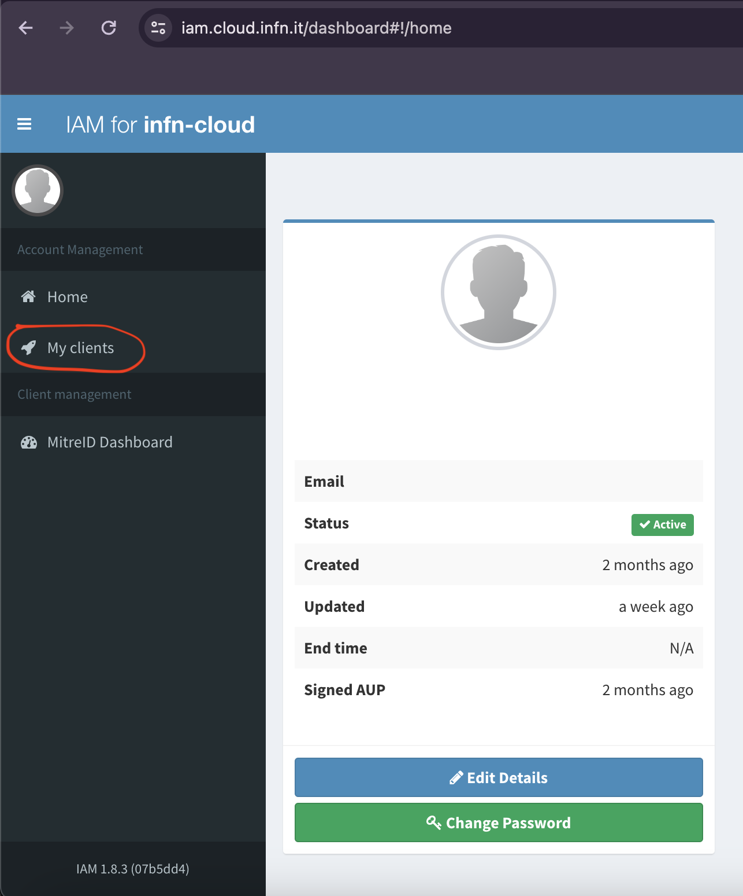
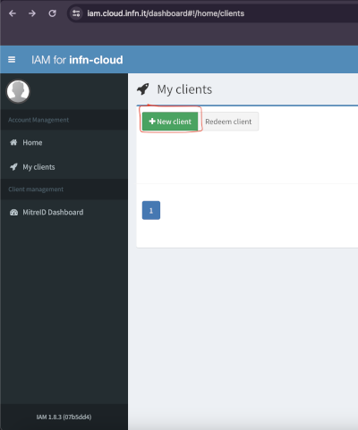
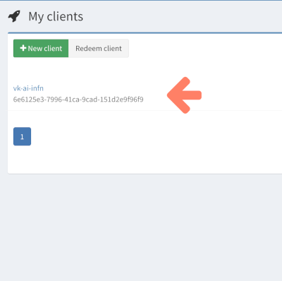

# Configure OpenID connect identity providers

In alternative of the GitHub authentication flow, we support any OpenID compliant identity provider. The following are a few examples.

## EGI Check-in

If you have an account for [EGI check-in](https://aai.egi.eu), you should be able to set it for authenticating the virtual kubelet with the interLink remote components with the following piece of configuration to be passed to the [installation script](./01-deploy-interlink.mdx).

```yaml
oauth:
  provider: oidc
  issuer: https://aai.egi.eu/auth/realms/egi
  scopes:
    - "openid"
    - "email"
    - "offline_access"
    - "profile"
  audience: interlink
  group_claim: email
  group: "YOUR EMAIL HERE"
  token_url: "https://aai.egi.eu/auth/realms/egi/protocol/openid-connect/token"
  device_code_url: "https://aai.egi.eu/auth/realms/egi/protocol/openid-connect/auth/device"
  client_id: "oidc-agent"
  client_secret: ""
```

:::danger
Remember to put your email in the group field!
:::

## Indigo IAM

If you have an account for [Indigo IAM](<https://iam.cloud.infn.it/>), you should be able to set it for authenticating the virtual kubelet with the interLink remote components.
Follow those steps to setup a new client in the IAM portal and get the necessary information to fill the configuration.

This guide is specific for the IAM portal <https://iam.cloud.infn.it/> but it should be similar for other IAM portals that are OpenID compliant.

1. Go to the [IAM portal](<https://iam.cloud.infn.it/>) and log in.
2. After logging in, click on the `My clients` tab on the left side  of the page and then select `New client` as shown in the images below.





3. Set a name you prefer for the client
4. Select the `Scopes` tab and add the following scopes: `openid`, `email`, `offline_access`, `profile`, `wlcg`, `wlcg.groups`
5. Select the `Grant types` tab and add the following grant types: `authorization_code`, `client_credentials`, `refresh_token`, `urn:ietf:params:oauth:grant-type:device_code`
6. Save the client by pressing the `Save client` button

After creating the client, you will be able to see the new client in the `My clients` page as show in the image below. 



You can click on the client to see the client details. You will find the `Client id` under the `Main` tab and the `Client secret` under the `Credentials` tab.

Now, with those information, you can fill this piece of configuration to be passed to the [installation script](./01-deploy-interlink.mdx).

```yaml
oauth:
    provider: oidc
    issuer: "https://iam.cloud.infn.it/"
    scopes:
      - "openid"
      - "email"
      - "offline_access"
      - "profile"
    audience: users
    group_claim: email
    group: "YOUR EMAIL HERE"
    token_url: "https://iam.cloud.infn.it/token"
    device_code_url: "https://iam.cloud.infn.it/devicecode"
    client_id: "YOUR CLIENT ID HERE"
    client_secret: "YOUR CLIENT SECRET HERE"
```
