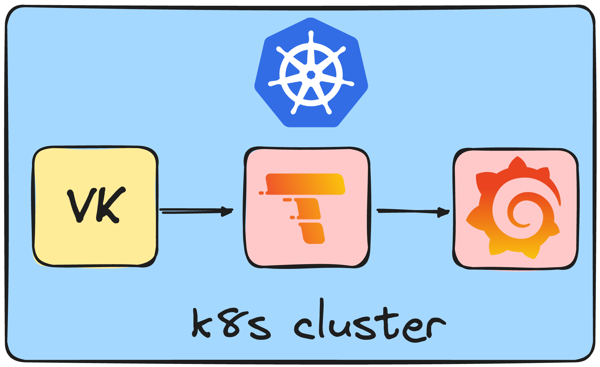

# InterLink Monitoring System

## Description

To monitor the InterLink stack, you can use an helm chart that deploys the entire stack and components needed for monitoring the Interlink components, in particular the Virtual Kubelet (VK) 
of the Interlink project. In the near future, the monitoring system will be extended to monitor other components of the Interlink project.

## Monitoring System Components

The monitoring system is composed of the following two components:
1. [Grafana Tempo](https://grafana.com/docs/tempo/latest/)
2. [Grafana](https://grafana.com)

### Grafana Tempo

Grafana Tempo (or simply **Tempo**) is an open-source distributed tracing backend developed by Grafana Labs designed to handle high-scale and high-volume distributed tracing data.
The choice of Tempo was made because of its key features: 
- **Scalability**: Tempo is designed to scale horizontally and handle millions of spans (a span is a single operation in a trace) per second. Moreover, it is capable of storing traces without requiring a database, instead leveraging object storage.
- **Simplicity**: Tempo does not index traces because it relies Grafana for querying and visualizing traces. This approach reduces complexity and operational overhead.
- **Cost**: Tempo is cost-effective because it uses object storage for storing traces, which is cheaper than traditional databases.
- **Integration**: Tempo integrates with popular tracing protocols. One of them is OpenTelemetry, which is used by the Virtual Kubelet (VK) of the Interlink project.
- **Querying**: Tempo provides a query language that allows users to filter and aggregate traces. It also supports distributed sampling, which allows users to sample traces across services. The powerful query language is a key feature that enables users to extract insights from traces and it is one of the main reasons why Tempo was chosen for the monitoring system.

### Grafana

Grafana is an open-source platform for monitoring and observability that allows users to query, visualize, alert on, and understand metrics no matter where they are stored. It is used to create, explore, and share dashboards with teams and stakeholders. Grafana supports a wide range of data sources, including Tempo.


## VK tracing

The Virtual Kubelet (VK) of the Interlink project is instrumented with **OpenTelemetry** to generate traces. OpenTelemetry is an open-source observability framework that provides APIs, libraries, agents, and instrumentation to collect telemetry data from applications and services. The traces generated by the VK are sent to Tempo, where they are stored and queried. 
Traces are generated by the VK when a request is made to the VK, and they contain information about the request, such as the details of the operation, the duration of the operation, and the services involved in the operation. A trace is a collection of spans, where each span represents a single operation in the trace. Spans are linked together to form a trace, which provides a complete view of the flow and performance of the operation. A span contains metadata, such as the name of the operation, the start and end time of the operation, and the service that generated the span.

The flow is represented in the following image:



In the actual setup, Tempo is deployed in the same Kubernetes cluster as the VK. Thanks to a Kubernetes service, the VK can send traces to Tempo. 
No TLS is used for the communication between the VK and Tempo, as the communication is internal to the cluster.
In the near future, the communication between the VK and Tempo will be secured using TLS if Tempo is deployed outside the cluster and a proxy will be used to authenticate the VK with Tempo.

The following table is a list of spans generated by the VK:

| Span Name | Description | Attributes |
| --- | --- | --- |
| CreateHttpCall | Span that represents the HTTP call made by the VK to the Interlink API to create a pod. | pod.name, pod.namespace, start.timestamp, end.timestamp, duration, exitc.code |
| DeleteHttpCall | Span that represents the HTTP call made by the VK to the Interlink API to delete a pod. | pod.name pod.namespace, start.timestamp, end.timestamp, duration, exitc.code |
| StatusHttpCall | Span that represents the HTTP call made by the VK to the Interlink API to get the status of a pod. | pod.name pod.namespace, start.timestamp, end.timestamp, duration, exitc.code |
| LogHttpCall | Span that represents the HTTP call made by the VK to the Interlink API to get the logs of a pod. | pod.name pod.namespace, start.timestamp, end.timestamp, duration, exitc.code |
| PingHttpCall | Span that represents the HTTP call made by the VK to the Interlink API check if the API is alive. | start.timestamp, end.timestamp, duration, exitc.code |
| CreatePodVK | Span that represents the call made by the VK to the Kubernetes API to create a pod. | pod.name pod.namespace, start.timestamp, end.timestamp, duration |
| DeletePodVK | Span that represents the call made by the VK to the Kubernetes API to delete a pod. | pod.name pod.namespace, start.timestamp, end.timestamp, duration |
| UpdatePodVK | Span that represents the call made by the VK to the Kubernetes API to update a pod. | pod.name pod.namespace, start.timestamp, end.timestamp, duration |
| GetPodVK | Span that represents the call made by the VK to the Kubernetes API to get a pod. | pod.name pod.namespace, start.timestamp, end.timestamp, duration |
| GetPodStatusVK | Span that represents the call made by the VK to the Kubernetes API to get the status of a pod. | pod.name pod.namespace, start.timestamp, end.timestamp, duration |
| GetPodsVK | Span that represents the call made by the VK to the Kubernetes API to get all pods. | start.timestamp, end.timestamp, duration |

## Installation

A requirement for the monitoring system is to have Helm installed in your Kubernetes cluster or in your local machine. If you don't have Helm installed, you can follow the instructions in the following link: https://helm.sh/docs/intro/install/

This helm chart requires a NGINX Ingress Controller to be installed in the cluster in order to expose the services and access them from outside the cluster. 
In particular, the Grafana service is exposed using an Ingress resource. 

To install the monitoring system, follow the steps below:

1. Clone the repository:

```bash
git clone https://github.com/interTwin-eu/interlink-monitoring-stack
```

2. Change the values in the `values.yaml` file to match your environment. 
3. Create a namespace for the monitoring system using the following command:

```bash
kubectl create namespace interlink-mon
```
4. Install the monitoring system using the following command:

```bash
helm upgrade --install helm-vk-monitoring-release interlink-monitoring-stack/ -n interlink-mon --debug
```

5. Access Grafana dashboard through the domain you defined in the `values.yaml` file with the credentials you defined in the `values.yaml` file. 

The following image shows the Grafana dashboard:

