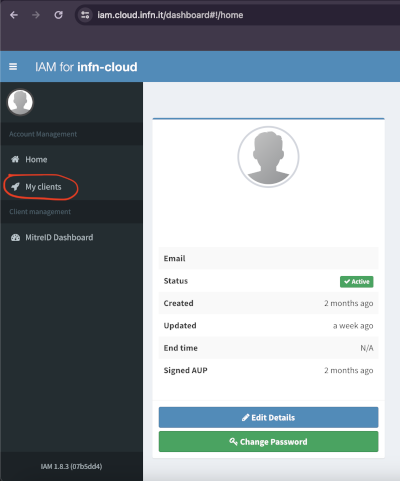
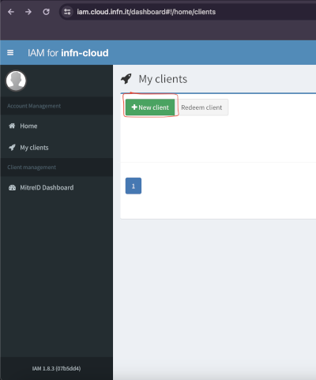
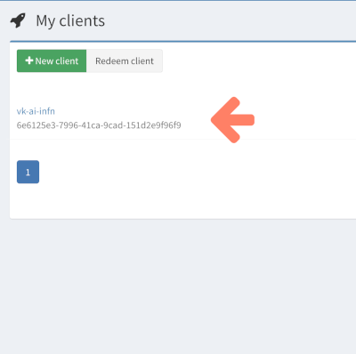

import ThemedImage from "@theme/ThemedImage";
import useBaseUrl from "@docusaurus/useBaseUrl";

# Configure OpenID connect identity providers

We support any OpenID compliant identity provider and also GitHub authN
workflow.

## OAuth Audience Configuration

When configuring OIDC providers, the `audience` field is required and specifies the intended audience for the JWT tokens. This field should match the audience configured in your OIDC provider and helps ensure tokens are intended for interLink. Different providers may use different audience values:

- **EGI Check-in**: Uses `interlink` as the audience
- **Indigo IAM**: Typically uses `users` or a custom client-specific audience
- **Generic OIDC**: Contact your provider administrator for the correct audience value

## GitHub authN

### Requirements

- **kubectl host**: an host with MiniKube installed and running
- A GitHub account
- **remote host**: A "remote" machine with a port that is reachable by the
  MiniKube host

### Create an OAuth GitHub app

As a first step, you need to create a GitHub OAuth application to allow
interLink to make authentication between your Kubernetes cluster and the remote
endpoint.

Head to [https://github.com/settings/apps](https://github.com/settings/apps) and
click on `New GitHub App`. You should now be looking at a form like this:

<ThemedImage alt="Docusaurus themed image" sources={{
    light: useBaseUrl("/img/github-app-new.png"),
    dark: useBaseUrl("/img/github-app-new.png"),
  }} />

Provide a name for the OAuth2 application, e.g. `interlink-demo-test`, and you
can skip the description, unless you want to provide one for future reference.
For our purpose Homepage reference is also not used, so fill free to put there
`https://interlink-hq.github.io/interLink/`.

Check now that refresh token and device flow authentication:

<ThemedImage alt="Docusaurus themed image" sources={{
    light: useBaseUrl("/img/github-app-new2.png"),
    dark: useBaseUrl("/img/github-app-new2.png"),
  }} />

Disable webhooks and save clicking on `Create GitHub App`

<ThemedImage alt="Docusaurus themed image" sources={{
    light: useBaseUrl("/img/github-app-new3.png"),
    dark: useBaseUrl("/img/github-app-new3.png"),
  }} />

You can click then on your application that should now appear at
[https://github.com/settings/apps](https://github.com/settings/apps) and you
need to save two strings: the `Client ID` and clicking on
`Generate a new client secret` you should be able to note down the relative
`Client Secret`.

Now it's all set for the next steps. You should be able to set it for
authenticating the virtual kubelet with the interLink remote components with the
following piece of the installer configuration:

```yaml
oauth:
  provider: github
  issuer: https://github.com/oauth
  grant_type: authorization_code
  scopes:
    - "read:user"
  github_user: "GH USERNAME HERE"
  token_url: "https://github.com/login/oauth/access_token"
  device_code_url: "https://github.com/login/device/code"
  client_id: "XXXXXXX"
  client_secret: "XXXXXXXX"
```

## EGI Check-in

If you have an account for [EGI check-in](https://aai.egi.eu), you should be
able to set it for authenticating the virtual kubelet with the interLink remote
components with the following piece of the installer configuration:

```yaml
oauth:
  provider: oidc
  issuer: https://aai.egi.eu/auth/realms/egi
  scopes:
    - "openid"
    - "email"
    - "offline_access"
    - "profile"
  audience: interlink
  grant_type: authorization_code
  group_claim: email
  group: "YOUR EMAIL HERE"
  token_url: "https://aai.egi.eu/auth/realms/egi/protocol/openid-connect/token"
  device_code_url: "https://aai.egi.eu/auth/realms/egi/protocol/openid-connect/auth/device"
  client_id: "oidc-agent"
  client_secret: ""
```

:::danger

Remember to put your email in the group field! 

:::

## Indigo IAM

If you have an account for [Indigo IAM](https://iam.cloud.infn.it/), you should
be able to set it for authenticating the virtual kubelet with the interLink
remote components. Follow those steps to setup a new client in the IAM portal
and get the necessary information to fill the configuration. This guide is
specific for the IAM portal
[https://iam.cloud.infn.it/](https://iam.cloud.infn.it/) but it should be
similar for other IAM portals that are OpenID compliant.

1. Go to the [IAM portal](https://iam.cloud.infn.it/) and log in.
2. After logging in, click on the `My clients` tab on the left side of the page
   and then select `New client` as shown in the images below.


 3. Set a name you prefer for the
client. 4. Select the `Scopes` tab and add the following scopes: `openid`,
`email`, `offline_access`, `profile`, `wlcg`, `wlcg.groups`. 5. Select the
`Grant types` tab and add the following grant types: `authorization_code`,
`client_credentials`, `refresh_token`,
`urn:ietf:params:oauth:grant-type:device_code`. 6. Save the client by pressing
the `Save client` button.

After creating the client, you will be able to see the new client in the
`My clients` page as show in the image below.



You can click on the client to see the client details. You will find the
`Client id` under the `Main` tab and the `Client secret` under the `Credentials`
tab. Now, with those information, you can fill this piece of the installer
configuration:

```yaml
oauth:
  provider: oidc
  issuer: "https://iam.cloud.infn.it/"
  scopes:
    - "openid"
    - "email"
    - "offline_access"
    - "profile"
  audience: users
  grant_type: authorization_code
  group_claim: email
  group: "YOUR EMAIL HERE"
  token_url: "https://iam.cloud.infn.it/token"
  device_code_url: "https://iam.cloud.infn.it/devicecode"
  client_id: "YOUR CLIENT ID HERE"
  client_secret: "YOUR CLIENT SECRET HERE"
```
